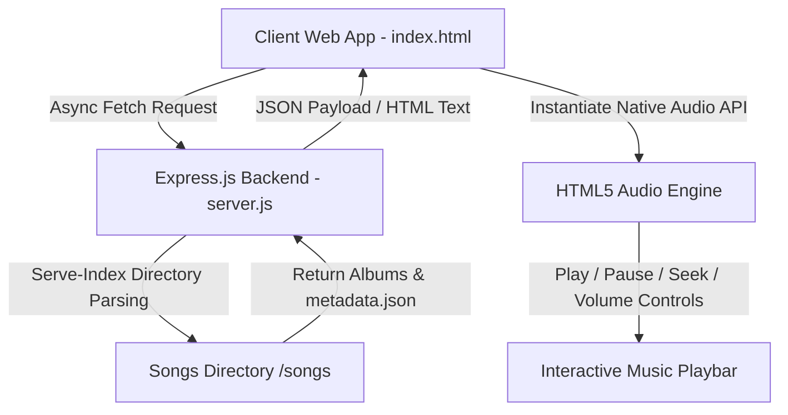

# 🚀 Modern Web Development Projects Portfolio

Welcome to the ultimate web development repository by **G Dinesh**! This repository serves as a professional showcase of frontend and full-stack excellence, featuring high-fidelity clones of industry-leading applications like **Spotify** and **Netflix**. 

These projects are engineered using modern, semantic web standards (HTML5, CSS3, JavaScript ES6+, and Node.js/Express) with a strong emphasis on pixel-perfect layouts, responsive design systems, dynamic asynchronous data fetching, and micro-interactions.

---

## 🌟 Repository Overview

This mono-repository hosts standalone web application projects, each housed within its own directory:

| Project | Type | Tech Stack | Live Demo | Source Folder | Key Showcase |
| :--- | :--- | :--- | :--- | :--- | :--- |
| **🎵 Spotify Nostalgia Player** | Full-Stack App | HTML5, CSS3, JS (ES6+), Node.js, Express | [Live Stream Demo](https://spotify-clone2-kxb3.onrender.com/) | [`/spotify-clone`](./spotify-clone) | Dynamic folder parsing, HTML5 Audio API, Responsive player controls |
| **🎬 Netflix Landing Page** | Frontend Clone | HTML5, CSS3 (Flexbox & CSS Grid) | [Live UI Demo](https://dinesh9997.github.io/web-development-projects/Netflix-clone/) | [`/Netflix-clone`](./Netflix-clone) | Pixel-perfect responsive layout, semantic structure, rich dark aesthetics |

---

## 📂 Directory Architecture

```bash
web-development-projects/
├── Netflix-clone/                  # Netflix High-Fidelity UI Clone
│   ├── assets/                     # Graphic assets (logos, icons, banners)
│   ├── index.html                  # Semantic HTML structural core
│   └── styles.css                  # Custom layout stylesheets (CSS Grid & Flexbox)
│
├── spotify-clone/                  # Full-Stack Nostalgia Spotify Web Player
│   ├── icons/                      # Inverted custom SVGs & interactive media controls
│   ├── songs/                      # Nostalgic audio playlists database
│   │   ├── ben10/                  # Cover image, info metadata, & theme soundtrack
│   │   ├── doraemon/               # Title songs, background scores, & album info
│   │   ├── heidi/                  # Nostalgic folder containing audio assets
│   │   └── ... (shinchan, pokemon, superrobo, magicwonderland, phineas&ferb)
│   ├── index.html                  # Desktop & mobile-first player UI shell
│   ├── script.js                   # Client-side state controller & HTML5 Audio interface
│   ├── server.js                   # Node.js backend using Express and directory index serving
│   ├── style.css                   # Custom global visual stylesheet (Dark Theme)
│   ├── utitlity.css                # Utility helper rules (margin, padding, flex spacing)
│   └── package.json                # Project configurations & dependency manifest
│
└── README.md                       # Repository Master Documentation
```

---

## 🎵 Featured Project 1: Spotify Nostalgia Web Player

> **"A custom, responsive audio streaming web player curated with childhood nostalgic soundtrack albums."**

The **Spotify Nostalgia Player** is a highly interactive, responsive full-stack application. It implements real-time audio playback using the HTML5 Audio API, coupled with a dynamic backend that automatically parses directory contents to generate albums and custom music libraries on the fly.



### ✨ Advanced Technical Highlights

*   **Dynamic Album Loading via Express/Serve-Index**: The backend uses Node.js and Express to expose a dynamic filesystem index. The client-side application performs asynchronous `fetch` requests to query `songs/` subfolders, reading custom `info.json` files and `cover.jpg` graphics to construct album tiles automatically.
*   **Precision Native Audio Engine**: Built on top of the native JavaScript `Audio` class, maintaining synchronized states for play/pause toggle triggers, previous/next track selection, volume sliders, interactive muting, and seekable progress tracking.
*   **Pixel-Perfect Dynamic Seekbar**: An interactive progress bar calculates user offset percentages (`offsetX` mapped against bounds retrieved via `getBoundingClientRect()`) to support linear audio scrubbing.
*   **Fully-Adaptive Mobile UX**: Features an elegant hamburger-menu trigger and collapsible navigation sidebar designed using transitions (`transition: all .3s ease-in-out`), making the player seamless across all phones and tablets.

### 🛠️ Technology Stack & Dependencies

*   **Frontend**: Native Semantic HTML5, CSS3 Custom Properties (CSS variables), Vanilla JavaScript (ES6+ Asynchronous/Await, Dynamic DOM Node Generation).
*   **Backend**: Node.js, Express.js (High-performance static file delivery).
*   **Packages**: `serve-index` (Directory-to-HTML routing parser).

---

## 🎬 Featured Project 2: Netflix Landing Page Clone

> **"A pixel-perfect responsive clone of the modern, immersive Netflix UI landing platform."**

The **Netflix Clone** focuses on rich design aesthetics, featuring responsive components, smooth interactive accordions, high-resolution media carousels, and an immersive dark-mode grid architecture.

### ✨ Advanced Technical Highlights

*   **Complex Grid Alignments**: Heavily leverages modern **CSS Grid** and **Flexbox** rules to achieve perfectly aligned horizontal movie scrolls and proportional banners.
*   **Interactive Design Systems**: Uses precise micro-transitions, customized focus rings, dynamic hover styling, and glassmorphic inputs.
*   **Strict Accessibility & SEO**: Implements standard HTML5 structural tags (`<header>`, `<nav>`, `<main>`, `<section>`, `<footer>`) to secure an optimized SEO indexing hierarchy and high accessibility compatibility.

---

## 🚀 Getting Started & Local Development

Follow these simple instructions to download and run the projects locally on your computer.

### 📋 Prerequisites

To run the full-stack Spotify clone, make sure you have the following installed:
*   [Node.js](https://nodejs.org/) (Version 16.x or higher recommended)
*   [Git](https://git-scm.com/)

### 🔧 Step-by-Step Installation

1.  **Clone the Repository**:
    ```bash
    git clone https://github.com/dinesh9997/web-development-projects.git
    cd web-development-projects
    ```

2.  **Navigate to the Spotify Clone Directory**:
    ```bash
    cd spotify-clone
    ```

3.  **Install Node Dependencies**:
    ```bash
    npm install
    ```

4.  **Start the Local Server**:
    ```bash
    npm start
    ```

5.  **Access the Application**:
    *   Open your web browser and navigate to: `http://localhost:10000`
    *   Enjoy listening to nostalgic childhood soundtracks on your own custom web player!

> [!NOTE]
> The **Netflix Landing Page Clone** is a purely static frontend layout and does not require starting a local Node.js server. Simply double-click [`Netflix-clone/index.html`](./Netflix-clone/index.html) to open and run it instantly in any web browser.

---

## 👨‍💻 Engineering Profiles & Portfolio

### **G Dinesh**
> **B.Tech – Computer Science (Artificial Intelligence)**
*   **Specialization**: Responsive UI/UX Systems, Asynchronous JavaScript Architectures, Node.js Full-Stack Engineering, Artificial Intelligence Solutions.
*   **Development Philosophy**: Crafting beautiful, high-performance web products that unify robust backend functionality with stunning user interfaces.

---

## 🤝 Contributing & License

Contributions, feedback, and structural suggestions are always welcome! Feel free to fork the repository, open a pull request, or submit an issue to suggest features.

Licensed under the [MIT License](LICENSE) — Feel free to use these architectures for learning, portfolio extensions, and reference designs.

*Made with 💖, HTML5, CSS3, and JavaScript.*