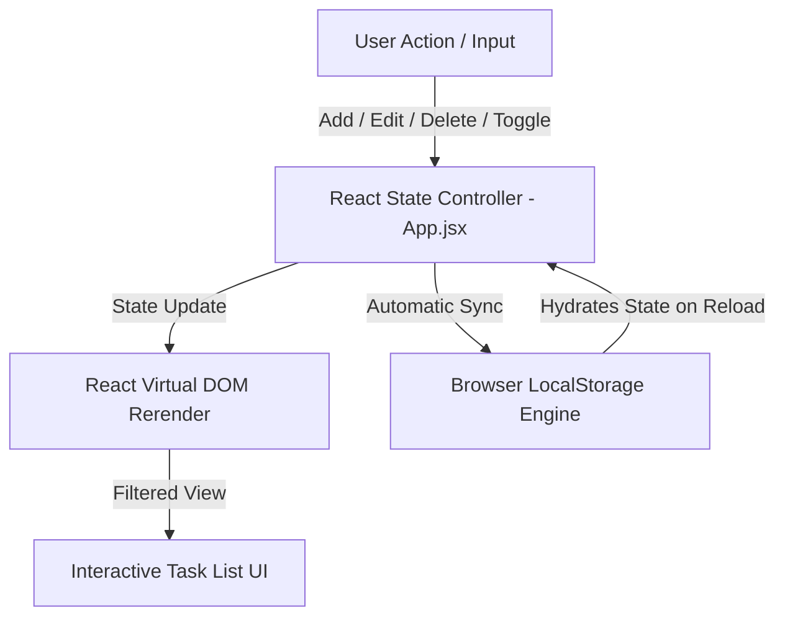
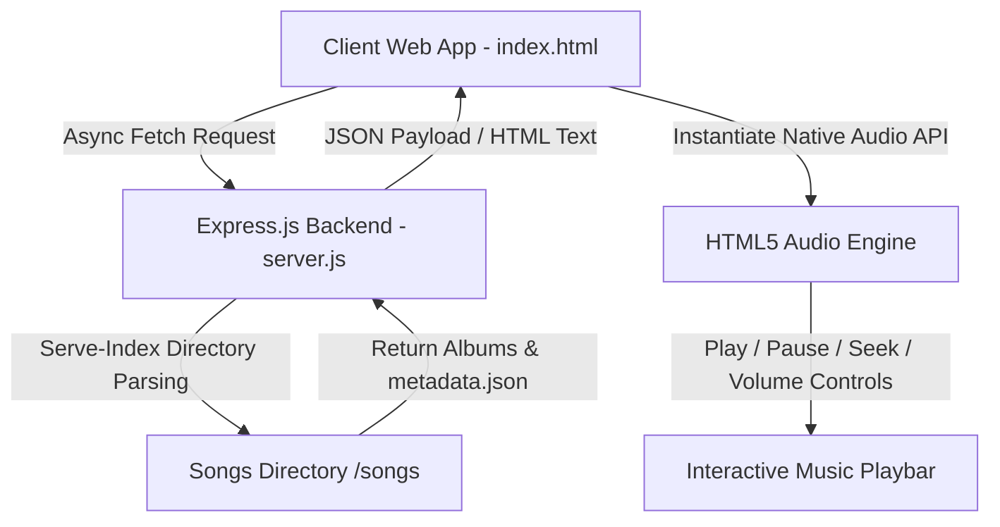

# 🚀 Modern Web Development Projects Portfolio

[](https://todo-list-dinesh.vercel.app/)
[](https://spotify-clone2-kxb3.onrender.com/)
[](https://dinesh9997.github.io/web-development-projects/Netflix-clone/)
[](LICENSE)

Welcome to the ultimate web development repository by **G Dinesh**! This repository serves as a professional showcase of frontend and full-stack engineering excellence, featuring production-ready web applications, interactive web tools, and high-fidelity clones of industry-leading applications like **Spotify** and **Netflix**.

These applications are engineered using modern, semantic web standards, modern JavaScript libraries (React 19, Vite, Node.js/Express, Tailwind CSS v4), responsive design systems, asynchronous state management, and real-time data persistence.

---

## 🌟 Repository Overview

This mono-repository hosts standalone web application projects, each housed within its own dedicated directory:

| Project | Type | Tech Stack | Live Demo | Source Directory | Key Showcase |
| :--- | :--- | :--- | :--- | :--- | :--- |
| **📝 iTask - Todo List App** | React Web App | React 19, Vite 8, Tailwind CSS v4, LocalStorage | [🌐 Live App (Vercel)](https://todo-list-dinesh.vercel.app/) | [`/TodolistApp`](./TodolistApp) | LocalStorage persistence, dynamic task editing/filtering, UUID collision-free IDs, Tailwind v4 UI |
| **🎵 Spotify Nostalgia Player** | Full-Stack App | HTML5, CSS3, JS (ES6+), Node.js, Express | [🎧 Live Player (Render)](https://spotify-clone2-kxb3.onrender.com/) | [`/spotify-clone`](./spotify-clone) | Dynamic folder parsing, HTML5 Audio Engine, responsive player UI, audio scrubbing seekbar |
| **🎬 Netflix Landing Page** | Frontend Clone | HTML5, CSS3 (Flexbox & CSS Grid) | [🎬 Live UI (GitHub Pages)](https://dinesh9997.github.io/web-development-projects/Netflix-clone/) | [`/Netflix-clone`](./Netflix-clone) | Pixel-perfect responsive grid, interactive FAQs accordion, dark aesthetics |

---

## 📂 Directory Architecture

```bash
web-development-projects/
├── TodolistApp/                    # iTask - Modern React 19 Task Management Application
│   ├── public/                     # Static assets & favicons
│   ├── src/                        # React components, hooks & application logic
│   │   ├── components/             # Reusable UI components (NavBar, etc.)
│   │   ├── App.jsx                 # Core task engine & state controller
│   │   ├── index.css               # Tailwind CSS imports
│   │   └── main.jsx                # Application root mounting point
│   ├── package.json                # React 19, Vite & Tailwind CSS dependencies
│   ├── vite.config.js              # Vite compiler configuration
│   └── README.md                   # TodolistApp technical documentation
│
├── spotify-clone/                  # Full-Stack Nostalgia Spotify Web Player
│   ├── icons/                      # Custom SVGs & interactive media controls
│   ├── songs/                      # Audio soundtrack database & album metadata
│   ├── index.html                  # Desktop & mobile player UI shell
│   ├── script.js                   # Client state controller & HTML5 Audio engine
│   ├── server.js                   # Express.js backend & static directory parser
│   ├── style.css                   # Custom global visual stylesheet (Dark Theme)
│   ├── utitlity.css                # CSS helper classes
│   └── package.json                # Express server dependencies
│
├── Netflix-clone/                  # Netflix High-Fidelity UI Landing Page
│   ├── assets/                     # Graphic assets (logos, hero banners, icons)
│   ├── index.html                  # Semantic structural markup
│   └── styles.css                  # Custom layout styles (CSS Grid & Flexbox)
│
└── README.md                       # Master Portfolio Repository Documentation
```

---

## 📝 Featured Project 1: iTask - React Task & Todo Management App

> **"A responsive task management application built with React 19, Vite 8, Tailwind CSS v4, and LocalStorage state persistence."**

[](https://todo-list-dinesh.vercel.app/)

The **iTask Todo Application** allows users to organize daily workflows with real-time UI reactive updates, persistent browser state, task editing, and completion filtering.



### ✨ Technical Highlights

* **Automatic State Synchronization**: Implements `localStorage` persistence inside React `useEffect` hooks to maintain state across browser reloads.
* **UUID Collision-Free Identifiers**: Integrates `uuidv4` for unique key generation, eliminating DOM re-rendering artifacts during mutations.
* **In-Place Task Editing**: Dynamically populates input state with target task text for seamless modification.
* **Filtered Task Views**: Toggle finished tasks dynamically without destroying original array data.
* **Modern Tailwind CSS v4 Layout**: Built with a mobile-first responsive container, custom color scales, and smooth interaction states.

---

## 🎵 Featured Project 2: Spotify Nostalgia Web Player

> **"A custom audio streaming web player curated with childhood nostalgic soundtrack albums."**

[](https://spotify-clone2-kxb3.onrender.com/)

The **Spotify Nostalgia Player** is an interactive, responsive full-stack application featuring dynamic directory parsing via Express and client-side HTML5 Audio API controls.



### ✨ Technical Highlights

* **Dynamic Directory Indexing**: Backend exposes filesystem directories via Node.js/Express `serve-index`, allowing asynchronous album metadata fetching.
* **HTML5 Audio Engine**: Precise audio playback tracking, seek scrubbing based on click offsets (`offsetX`), volume modulation, and play/pause controls.
* **Adaptive Mobile Controls**: Collapsible sidebar menu driven by smooth CSS transitions (`transition: all .3s ease-in-out`).

---

## 🎬 Featured Project 3: Netflix Landing Page Clone

> **"A pixel-perfect responsive clone of the modern Netflix streaming platform UI."**

[](https://dinesh9997.github.io/web-development-projects/Netflix-clone/)

The **Netflix Clone** showcases UI/UX layout engineering, leveraging CSS Grid, Flexbox, custom form controls, and accordions for an authentic dark-mode streaming layout.

### ✨ Technical Highlights

* **Advanced Layout Systems**: CSS Grid and Flexbox alignment for movie showcases, hero sections, and responsive cards.
* **Interactive FAQ Accordion**: CSS transitions and focus rings for seamless user interactions.

---

## 🚀 Getting Started & Local Development

Follow these simple instructions to run any of the projects locally on your computer.

### 📋 Prerequisites

* [Node.js](https://nodejs.org/) (v18.0.0 or higher recommended)
* [Git](https://git-scm.com/)

### 🔧 Setup Instructions

1. **Clone the Repository**:
   ```bash
   git clone https://github.com/dinesh9997/web-development-projects.git
   cd web-development-projects
   ```

2. **Run iTask (TodolistApp)**:
   ```bash
   cd TodolistApp
   npm install
   npm run dev
   ```
   * Access at: `http://localhost:5173`

3. **Run Spotify Nostalgia Player**:
   ```bash
   cd ../spotify-clone
   npm install
   npm start
   ```
   * Access at: `http://localhost:10000`

4. **Run Netflix Landing Page**:
   Simply open [`Netflix-clone/index.html`](./Netflix-clone/index.html) directly in any modern web browser.

---

## 👨‍💻 Engineering Profile

### **G Dinesh**
> **B.Tech – Computer Science (Artificial Intelligence)**

* **Focus Areas**: React / Next.js Frontend Development, UI/UX Engineering, Responsive Design Systems, Node.js Full-Stack Architectures, Modern Web Tooling.
* **GitHub**: [@dinesh9997](https://github.com/dinesh9997)

---

## 🤝 Contributing & License

Contributions, feedback, and star support are always welcome! Feel free to fork the repository, open a pull request, or submit issues.

Licensed under the [MIT License](LICENSE) — Feel free to use these codebase architectures for learning and portfolio references.

*Built with 💖 using React 19, Vite, Tailwind CSS, HTML5, CSS3, and Node.js.*