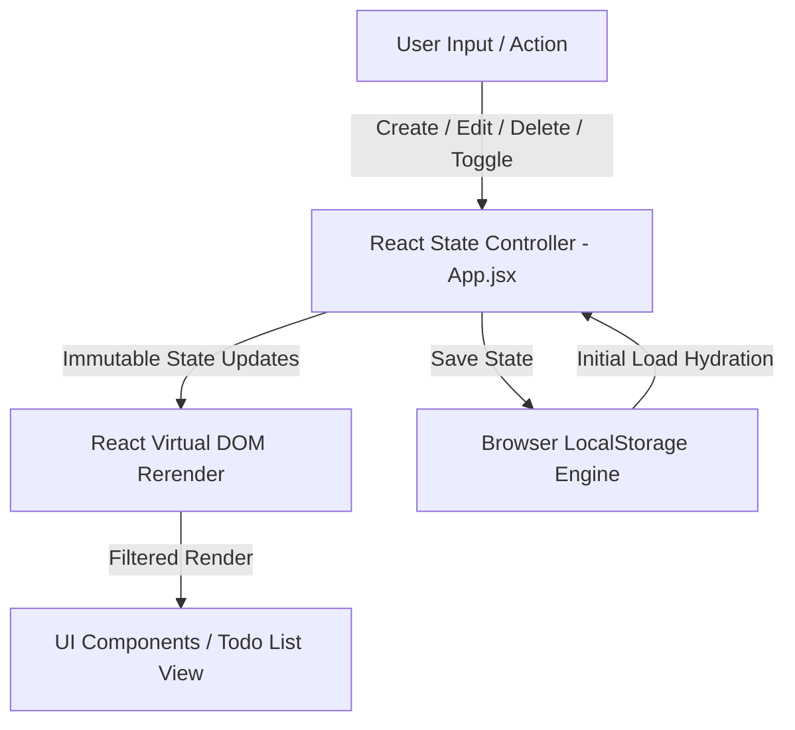

# ⚡ iTask - Task & Todo Management Web Application

[](https://todo-list-dinesh.vercel.app/)
[](https://react.dev/)
[](https://vitejs.dev/)
[](https://tailwindcss.com/)
[](../../LICENSE)

> **"A sleek, responsive, real-time Task Management application engineered with React 19, Vite 8, Tailwind CSS v4, and LocalStorage state persistence."**

---

## 🔗 Live Application

Check out the live deployed application on Vercel:  
👉 **[https://todo-list-dinesh.vercel.app/](https://todo-list-dinesh.vercel.app/)**

---

## 📌 Executive Overview

**iTask** is a modern, high-performance Task & Todo Management web application designed to help users track, organize, and manage daily responsibilities effortlessly. Built using **React 19** and styled with **Tailwind CSS v4**, **iTask** delivers a responsive layout, instant state synchronization via browser `localStorage`, and collision-free task tracking using `uuidv4`.

---

## ✨ Key Features

* 📝 **Instant Task Creation**: Quickly input and save tasks with built-in input validation (minimum character guard prevents empty/accidental entries).
* 💾 **Persistent LocalStorage Engine**: All task items, completion states, and modifications are stored automatically in browser `localStorage`, ensuring data stays intact across browser sessions and refreshes.
* ✏️ **Dynamic In-Place Editing**: Easily update existing tasks—clicking edit populates the input field with the existing task string for fast modification.
* ❌ **Seamless Task Deletion**: One-click task removal powered by immutable state updates (`Array.prototype.filter`).
* 👁️ **Finished Task Filtering**: Dynamic checkbox filter to toggle visibility of completed tasks without altering the underlying dataset.
* 🆔 **UUID Collision-Free Tracking**: Employs RFC4122 compliant `uuidv4` identifiers to uniquely map each task node across state operations.
* 🎨 **Modern Responsive UI**: Clean, mobile-friendly design styled with Tailwind CSS v4, custom rounded containers, and crisp icons powered by `react-icons`.

---

## 🏗️ Technical Architecture & Flow



---

## 🛠️ Tech Stack & Dependencies

| Layer | Technology | Purpose |
| :--- | :--- | :--- |
| **Frontend Core** | [React 19](https://react.dev/) | Component-based UI library & hooks (`useState`, `useEffect`) |
| **Build Engine** | [Vite 8](https://vitejs.dev/) | Next-generation fast frontend tooling & HMR |
| **Styling** | [Tailwind CSS v4](https://tailwindcss.com/) | Modern utility-first CSS framework |
| **Icons** | [React Icons](https://react-icons.github.io/react-icons/) | Feather & Material icons (`FaEdit`, `MdDelete`) |
| **Unique IDs** | [UUID v4](https://www.npmjs.com/package/uuid) | RFC4122 unique identifier generation |
| **Deployment** | [Vercel](https://vercel.com/) | Global edge-network web application hosting |

---

## 📂 Project Structure

```bash
TodolistApp/
├── public/                     # Static assets & public resources
├── src/
│   ├── assets/                 # SVGs and static image assets
│   ├── components/
│   │   └── NavBar.jsx          # Header navigation bar component
│   ├── App.css                 # Application-level custom styling
│   ├── App.jsx                 # Core reactive task engine & main UI container
│   ├── index.css               # Tailwind CSS imports & global styles
│   └── main.jsx                # React application entry point
├── .gitignore                  # Git untracked pattern definitions
├── .oxlintrc.json              # Oxlint linter configuration
├── index.html                  # HTML5 shell entry document
├── package.json                # Project dependencies and script runner
├── vite.config.js              # Vite & Tailwind compiler configuration
└── README.md                   # Documentation
```

---

## 🚀 Getting Started & Local Development

Follow these steps to run **iTask** locally on your machine.

### Prerequisites

Ensure you have **Node.js** (v18.0.0 or higher) and **npm** installed on your system.

### Installation & Execution

1. **Clone the Repository** (if not already cloned):
   ```bash
   git clone https://github.com/dinesh9997/web-development-projects.git
   ```

2. **Navigate into the TodolistApp directory**:
   ```bash
   cd web-development-projects/TodolistApp
   ```

3. **Install Dependencies**:
   ```bash
   npm install
   ```

4. **Launch Development Server**:
   ```bash
   npm run dev
   ```

5. **Open Application**:
   Navigate to the local URL displayed in your terminal (typically `http://localhost:5173`).

---

## 📜 Available NPM Scripts

* `npm run dev` – Starts the local Vite development server with hot module replacement (HMR).
* `npm run build` – Compiles and bundles production-ready assets into the `dist/` folder.
* `npm run preview` – Locally previews the production build.
* `npm run lint` – Runs `oxlint` code analysis to ensure syntax and code style quality.

---

## 👨‍💻 Author & Contact

**G Dinesh**  
*   **GitHub**: [@dinesh9997](https://github.com/dinesh9997)
*   **Live App**: [https://todo-list-dinesh.vercel.app/](https://todo-list-dinesh.vercel.app/)

---

## 📄 License

This project is licensed under the [MIT License](../../LICENSE) — free for education, portfolio references, and personal development.
