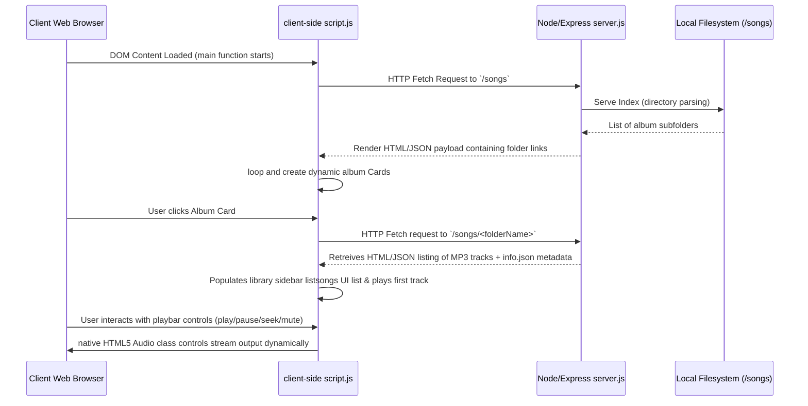

# 🎵 Spotify Nostalgia Player: Full-Stack Web App

A beautiful, high-fidelity responsive clone of the Spotify Web Player tailored to play **iconic, nostalgic cartoon and anime theme soundtracks** from childhood. 

This full-stack project is designed using semantic **HTML5, custom CSS3 properties, vanilla JavaScript (ES6+), and a Node.js/Express.js backend** that serves dynamic music albums straight from the server directory structure.

---

## 🌐 Live Deployment & Preview

🚀 **Experience the Live Application:**  
👉 **[Spotify Nostalgia Player Live Stream Demo](https://spotify-clone2-kxb3.onrender.com/)**

---

## ✨ Features Checklist

*   **📺 Nostalgia Theme & Playlists**: Dedicated albums packed with childhood classics, including:
    *   *Doraemon* (Title tracks, movies, background soundtracks)
    *   *Shinchan* (Classic theme and movie songs)
    *   *Ben 10* (Omniverse and classic opening tracks)
    *   *Pokémon, Heidi, Phineas & Ferb, Magic Wonderland, and Super Robot*
*   **📂 Automated Backend-Driven Playlist Loading**: The client fetches directory files dynamically, generating album cards with titles and descriptions sourced directly from standard local `info.json` files and loading album artwork from `cover.jpg`.
*   **🎧 Rich Interactive Playback Controls**:
    *   Dynamic **Play / Pause** buttons synchronized with global audio playback states.
    *   **Previous / Next** tracks with seamless looping.
    *   **Linear Scrubbing Seekbar**: Click or drag on the progress bar (calculates exact offsets relative to client bounds) to seamlessly jump to any time in the track.
    *   **Dynamic Volume Controller**: Slide to adjust, or click the volume icon to instantly **mute / unmute** with corresponding icon visual indicators.
*   **📱 Ultra-Responsive Layout**: Complete with custom CSS transition drawers and hamburger menus for an optimal mobile-first layout.

---

## 🏗️ Project Architecture & Logic Flow



---

## 🛠️ Technology Stack & APIs

| Layer | Technology | Details |
| :--- | :--- | :--- |
| **Frontend Layout** | HTML5 | Semantic structure (`<nav>`, `<main>`, `<section>`, custom SVG graphics) |
| **Frontend Styling**| CSS3 | Flexbox, grid alignment, custom media queries, transitions, backdrop-filter styling |
| **Client Engine**   | Vanilla JavaScript | DOM manipulation, asynchronous `fetch` calls, event-driven architecture |
| **Media Engine**    | JavaScript Audio API| Native `new Audio()` object handling stream buffering, time updates, and state listeners |
| **Server Engine**   | Node.js | Fast, scalable backend engine |
| **Web Server API**  | Express.js | Delivers static asset files and hosts routing controllers |
| **Directory Parser**| `serve-index` | Exposes directory listings to enable automated dynamic play list retrieval |

---

## 🚀 Setup & Local Execution Guide

To install and run the Spotify Nostalgia Player locally on your system:

### 1. Pre-requisites
Ensure you have [Node.js](https://nodejs.org/) installed (LTS version is recommended).

### 2. Installation Steps
Clone the project repository and navigate into the `spotify-clone` directory:
```bash
git clone https://github.com/dinesh9997/web-development-projects.git
cd web-development-projects/spotify-clone
```

Install the required npm server packages:
```bash
npm install
```

### 3. Running the Server
Launch the Node.js Express web server:
```bash
npm start
```
You will see output in the terminal indicating that the server is up and listening on port `10000`:
`Server running on port 10000`

### 4. Viewing the Player
Open your internet browser and navigate to:
👉 **`http://localhost:10000`**

---

## 🎨 Creative Code Highlights

### **Dynamic Asynchronous Directory Fetching**
The application reads folders dynamically using asynchronous Javascript rather than hardcoding song lists:
```javascript
async function getSongs(folder) {
    currFolder = folder;
    let a = await fetch(`/${folder}`);
    let response = await a.text();
    let div = document.createElement("div");
    div.innerHTML = response;
    let as = div.getElementsByTagName("a");
    songs = [];
    for (let index = 0; index < as.length; index++) {
        const element = as[index];
        if (element.href.endsWith("mp3")) {
            songs.push(element.href.split(`/${folder}/`)[1]);
        }
    }
    // Dynamic sidebar listsongs insertion
    ...
}
```

### **Responsive Control Panels**
CSS transitions ensure folders and track lists slide out elegantly on smaller mobile viewports:
```css
@media (max-width: 1200px) {
  .left {
    background-color: black;
    position: absolute;
    left: -120%;
    transition: all .3s ease-in-out;
    z-index: 5;
    width: 373px;
  }
  /* When hamburger is active */
  .left.active {
    left: 0;
  }
}
```

---

## 👨‍💻 Project Developer

**G Dinesh**
*   B.Tech – Computer Science (Artificial Intelligence)
*   Portfolio: [G Dinesh Web Development Projects](./README.md)

*Relive your childhood with the melodies of nostalgia! ⭐ Star this repository if you enjoyed it!*
